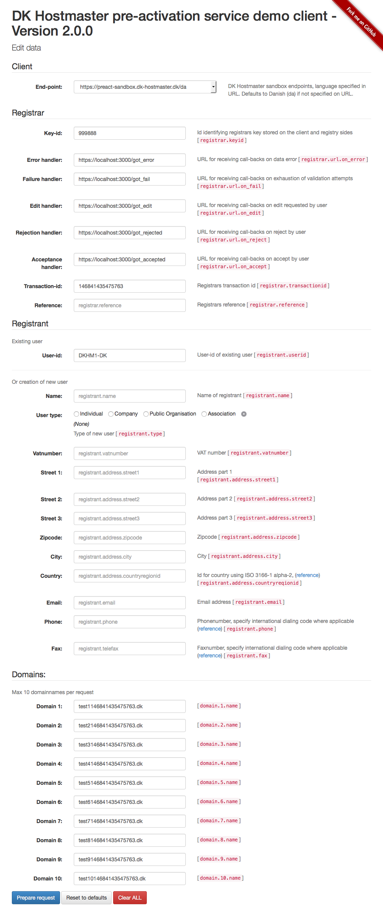

# DK Hostmaster pre-activation service demo client

<!-- MarkdownTOC -->

- [VERSION](#version)
- [USAGE](#usage)
    - [Using `docker`](#using-docker)
- [INSTALLATION](#installation)
- [DEPENDENCIES](#dependencies)
- [DIAGNOSTICS](#diagnostics)
    - [Random field validation errors](#random-field-validation-errors)
- [SEE ALSO](#see-also)
- [COPYRIGHT](#copyright)
- [LICENSE](#license)

<!-- /MarkdownTOC -->



<a name="version"></a>
# VERSION

This documentation describes version 2.0.X

<a name="usage"></a>
# USAGE

    $ morbo -l https://*:3000 client.pl

Open your browser at:

    https://127.0.0.1:3000/


<a name="using-docker"></a>
## Using `docker`

The application can be used using `docker`

    $ docker build -t preact-demo-client .

    $ docker run --rm -p 3000:3000 preact-demo-client

Open your browser at:

    https://localhost:3000/

<a name="installation"></a>
# INSTALLATION

This client requires a [Perl](http://en.wikipedia.org/wiki/Perl) interpreter.

You need to install the [Mojolicious framework](http://mojolicio.us/) and then you need to install the dependencies listed below.

<a name="dependencies"></a>
# DEPENDENCIES

The client is implemented using [Mojolicious::Lite](https://metacpan.org/pod/Mojolicious::Lite) in addition the following Perl modules are used all available from CPAN.

- [Mojolicious](https://metacpan.org/pod/Mojolicious) installed in the step above (MetaCPAN)
- [IO::Socket::SSL](https://metacpan.org/pod/IO::Socket::SSL) (MetaCPAN)
- [Time::HiRes](https://metacpan.org/pod/Time::HiRes) (MetaCPAN, in core since Perl version 5.7.3)
- [Digest](https://metacpan.org/pod/Digest) (MetaCPAN), in core since Perl version 5.7.3)
- [IO::Socket::IP](https://metacpan.org/pod/IO::Socket::IP) (MetaCPAN)

A `cpanfile` and related `cpanfile.snapshot` are included in the repository and can be used in conjunction with [Carton](https://metacpan.org/pod/Carton) if you want to evaluate the client without interfering with your existing Perl installation

```
$ carton

$ carton exec morbo -l https://*:3000 client.pl
```

In addition to the Perl modules, the client uses Twitter Bootstrap and hereby jQuery. These are automatically downloaded via CDNs and are not distributed with the client software.

- http://getbootstrap.com/

<a name="diagnostics"></a>
# DIAGNOSTICS

<a name="random-field-validation-errors"></a>
## Random field validation errors

If you are observing errors, where each request report a problem with a new parameter/field, this can be a symptom that you are not using https, please see: [usage](#usage).

<a name="see-also"></a>
# SEE ALSO

The main site for this client is the [Github repository](https://github.com/DK-Hostmaster/preact-demo-client-mojolicious).

For information on the service, please refer to [the specification](https://github.com/DK-Hostmaster/preactivation-service-specification) from DK Hostmaster or [the service main page with DK Hostmaster](https://www.dk-hostmaster.dk/english/technical-administration/tech-notes/pre-activation/).

<a name="copyright"></a>
# COPYRIGHT

This software is under copyright by DK Hostmaster A/S 2015

<a name="license"></a>
# LICENSE

This software is licensed under the MIT software license

Please refer to the LICENSE file accompanying this file.
